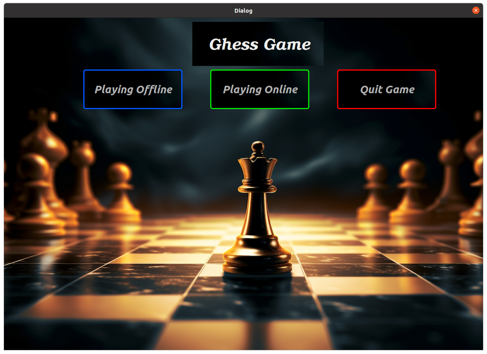
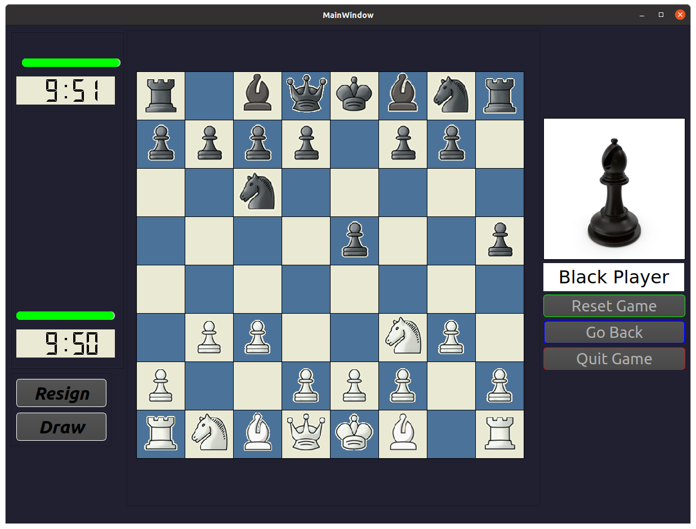

# Chess Game (C++ & Qt)

A simple **Chess Game** built with **C++** and the **Qt** framework.  
The project demonstrates object-oriented design, GUI programming with Qt, and the implementation of core chess logic (legal moves, check, checkmate, castling, promotion, and en-passant).

---

## Overview
This project is a desktop Chess Game application that allows two players to play chess in **offline (local)** or **online** modes.  
It provides a user-friendly Qt-based interface and implements the official chess rules, move validation, and logging of played moves for analysis.

---

## Screenshots

### Intro Screen
<p align="center">
  
</p>

### Login Screen
<p align="center">
  
</p>

### Offline Game
<p align="center">
  
</p>

### Full Gameplay
<p align="center">
  
</p>

---

## Features
- 🎮 Implements complete chess rules:
  - Legal moves, check, checkmate
  - Castling, pawn promotion, en-passant
- 🖥️ Qt-based graphical interface
- ♟️ Player vs Player:
  - Local play on the same device
  - Online play (with login system)
- 📄 Logs moves into `logs/moves.log` for review
- 🧩 Modular and extensible design

---

## How to Play
1. **Start the application** → You will see the intro screen.
2. **Login/Choose mode**:
   - **Offline Mode**: Play locally against another player.
   - **Online Mode**: Log in and connect to play with another user.
3. **Game rules**: The board enforces chess rules (no illegal moves allowed).
4. Moves are recorded automatically in a log file for later analysis.

---

## Requirements
- C++11 or later  
- Qt 5 or Qt 6 (Qt Creator recommended)  
- Modern C++ compiler (g++, clang, or MSVC)  

---

## How to Build & Run

### Using Qt Creator (recommended)
1. Clone the repository:
   ```bash
   git clone https://github.com/MahmoudMohamedRashed/Chess-Game.git
   cd Chess-Game
