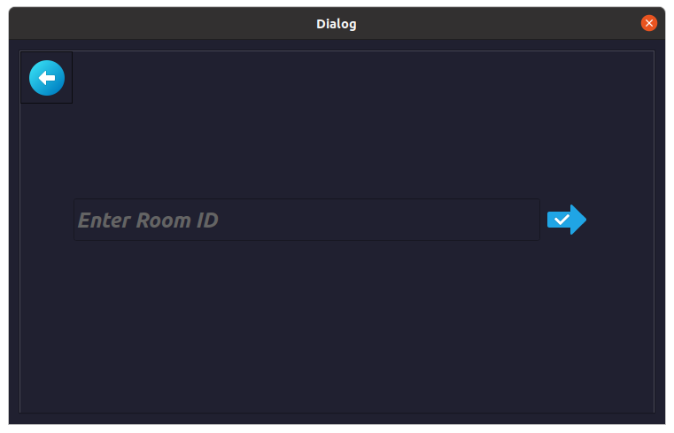

# Chess Game (C++ & Qt)

A simple **Chess Game** built with **C++** and the **Qt** framework.  
Demonstrates object-oriented design, Qt GUI, and core chess logic (moves, check/checkmate, castling, promotion).

<p align="center">
  
</p>

## Features
- 🎮 Full chess rules (legal moves, check, checkmate, castling, promotion, en-passant)
- 🖥️ Qt-based GUI with clickable board and piece highlights
- ♟️ Player vs Player (local) and Online mode support
- 📄 Move logging into `logs/moves.log` for analysis
- 🔁 Clean project structure for easy extension

## Requirements
- C++11 or later  
- Qt 5 or Qt 6 (Qt Creator recommended)  
- A modern C++ compiler (g++, clang, MSVC)

## How to Build & Run

### Using Qt Creator (recommended)
1. Clone the repository:
   ```bash
   git clone https://github.com/MahmoudMohamedRashed/Chess-Game.git
   cd Chess-Game
